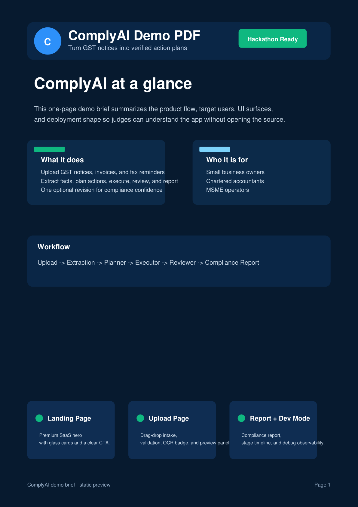

# ComplyAI

> **Turn GST notices into verified action plans.**

ComplyAI is an AI compliance workspace for Indian MSMEs, chartered accountants, and business owners who need to read a notice, understand the next steps, and produce a report they can actually act on.

[](https://comply-ai-five.vercel.app)
[](https://complyai-tsfo.onrender.com/api/health)
[](#built-with-openai-codex)



## Table of Contents

- [What ComplyAI is](#what-complyai-is)
- [Why it exists](#why-it-exists)
- [How to use it](#how-to-use-it)
- [Workflow](#workflow)
- [Supported documents](#supported-documents)
- [What happens behind the scenes](#what-happens-behind-the-scenes)
- [Tech stack](#tech-stack)
- [Project structure](#project-structure)
- [Getting started](#getting-started)
- [Testing](#testing)
- [Deployment](#deployment)
- [Built with OpenAI Codex](#built-with-openai-codex)

---

## What ComplyAI is

ComplyAI is **not a chatbot**. It is a document workflow system that takes GST-related files and turns them into a structured compliance plan.

### What it produces

- 📄 Compliance summary
- ✅ Required actions
- ⚠️ Missing information
- 🧾 Compliance checklist
- ✍️ Draft response
- 📊 Final compliance action report

### Who it is for

- 👤 Small business owners
- 👔 Chartered accountants
- 🏬 MSME operators

---

## Why it exists

GST notices are time-sensitive, easy to misread, and expensive to ignore. Many tools only explain a document, but they do not help you **finish the work**.

ComplyAI is built to solve that gap:

- 🧠 It structures the output instead of returning a generic answer
- 🔍 It highlights missing fields before the user acts
- 🛡️ It reviews the generated work before the report is finalized
- 🔁 It allows one controlled revision so the pipeline stays predictable
- 📦 It packages the result into a compliance-ready report

In short: **what it is for** is turning a noisy document into a usable action plan, and **why it matters** is because compliance work needs traceable next steps, not just explanation.

---

## How to use it

1. **Open the live app**  
   Visit the frontend and start from the landing page.

2. **Upload a supported document**  
   Use a GST notice, GST invoice, or tax reminder from the upload screen.

3. **Wait for the workflow to run**  
   ComplyAI validates the document, extracts fields, plans the response, executes the draft, and reviews it.

4. **Review the report**  
   Open the compliance action report to see deadlines, checklist items, missing information, and the draft response.

5. **Use Developer Mode if you want traceability**  
   The developer screen shows the pipeline, provider timing, fallback behavior, and structured JSON for each stage.

> If the backend is cold on Render, the first request may take a little longer to wake up. That is normal for the free tier.

---

## Workflow

```text
Upload
  ↓
Extraction
  ↓
Planner
  ↓
Executor
  ↓
Reviewer
  ↓
One optional revision
  ↓
Compliance Report
```

### What each stage does

- 🟦 **Upload**: validates file type and prepares the document
- 🟦 **Extraction**: pulls text and metadata from the file
- 🟦 **Planner**: classifies the document and identifies what matters
- 🟦 **Executor**: drafts actions, checklist items, and the response
- 🟦 **Reviewer**: checks consistency and completeness
- 🟦 **Revision**: runs once if the reviewer flags issues
- 🟦 **Compliance Report**: shows the final actionable result

---

## Supported documents

### Supported in v1.0

- GST Notice DRC-01
- GST Notice GSTR-3A
- GST Notice ASMT-10
- GST Invoice
- Tax Reminder

### Explicitly unsupported in v1.0

- Income tax notices
- Legal contracts
- Loan agreements
- Bank statements
- Utility bills
- General/unrelated documents

Unsupported files are rejected clearly instead of being guessed.

---

## What happens behind the scenes

ComplyAI uses a real agent workflow, not a single prompt:

| Stage | Purpose |
|---|---|
| Planner | Reads the document and creates a structured plan |
| Executor | Produces the draft response, checklist, and summary |
| Reviewer | Checks the output for missing information or inconsistencies |
| Report Composer | Packages the final result into the report view |

The backend uses:

- Groq as the primary model provider
- Gemini as the fallback provider
- Pydantic schemas to keep the output structured
- A single revision pass to keep the workflow deterministic

---

## Tech stack

| Layer | Technology |
|---|---|
| Frontend | React, Vite, Tailwind CSS, TypeScript |
| UI Motion | Framer Motion |
| Routing | React Router |
| Data | React Query |
| Forms | React Hook Form + Zod |
| Backend | FastAPI + Pydantic |
| Database | SQLite |
| Deployment | Vercel for frontend, Render for backend |

---

## Project structure

```text
ComplyAI/
├── frontend/                # React app and UI pages
│   └── src/
│       ├── pages/           # Landing, upload, workflow, report, developer mode
│       ├── features/        # Feature modules and page data
│       └── services/        # API client for backend calls
├── backend/                 # FastAPI app, agents, integrations, schemas
│   └── app/
│       ├── api/routes/      # HTTP endpoints
│       ├── services/        # Planner, Executor, Reviewer
│       ├── integrations/    # LLM client
│       └── schemas/         # Pydantic contracts
├── tests/                   # Regression and unit tests
├── sample_documents/        # Demo/test inputs
└── docs/                    # Architecture and deployment notes
```

---

## Getting started

### Prerequisites

- Python 3.11+
- Node.js 18+
- Groq API key
- Gemini API key

### Backend

```bash
cd backend
pip install -r requirements.txt
cp .env.example .env
uvicorn app.main:app --reload
```

### Frontend

```bash
cd frontend
npm install
echo "VITE_API_BASE_URL=http://localhost:8000" > .env
npm run dev
```

Then open:

- Frontend: `http://localhost:5173`
- Backend health: `http://localhost:8000/api/health`

---

## Testing

Run the backend test suite:

```bash
cd backend
python -m pytest tests/ -q
```

The regression flow also runs sample documents through the pipeline to make sure changes do not break supported cases or negative cases.

---

## Deployment

| Service | Platform | URL |
|---|---|---|
| Frontend | Vercel | https://comply-ai-five.vercel.app |
| Backend | Render | https://complyai-tsfo.onrender.com |

> The Render backend uses the free tier, so the first request after inactivity may be slower while the service wakes up.

---

## Built with OpenAI Codex

Codex was used to help build and iterate on the project architecture, backend services, frontend UI, tests, and deployment wiring.

This repo reflects a real build process:

- planning the workflow and file structure
- implementing the planner/executor/reviewer pipeline
- wiring the backend and frontend together
- fixing deployment issues and provider changes
- refining the README and demo material for judges

---

## License

Built for the ChatGPT Codex India Hackathon 2026.

